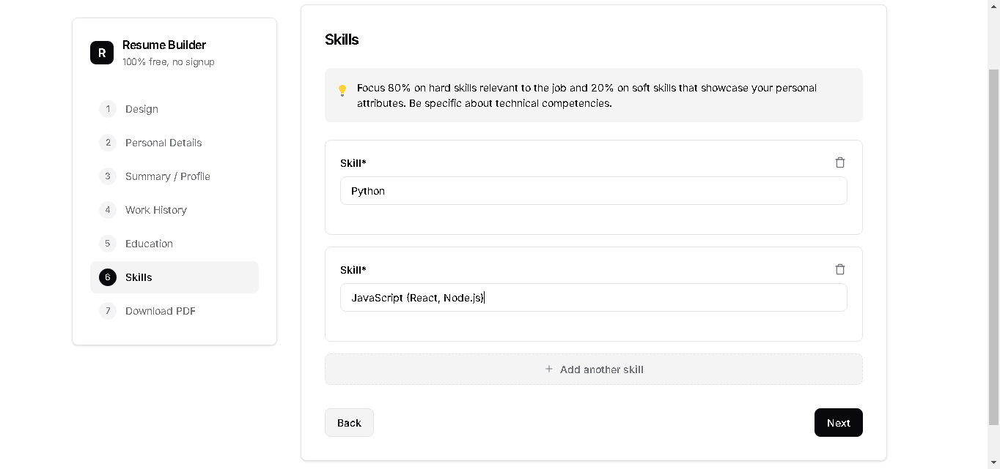

*Resume Builder*

- *Web application that helps users create professional resumes in minutes.*

*Features*

- *4 professional templates*
- *Step-by-step guided process*
- *PDF download*
- *No registration required*
- *Mobile responsive*

*Prerequisites*

- *Node.js*
- *npm or yarn*

*Installation & Setup*

```php
git clone https://github.com/natnaeltibebu/resume-builder.git
cd resume-builder
npm install
npm start
```

*Screenshots*
Step 1 – Choose Template  


Step 2 – Personal Details  


Step 3 – Summary  


Step 4 – Work Experience  


Step 5 – Education  


Step 6 – Skills  


Step 7 – Download Resume  


*Features*

- *4 professional templates*
- *Step-by-step guided process*
- *PDF download*
- *No registration required*
- *Mobile responsive*

*Prerequisites*

- *Node.js*
- *npm or yarn*

*Installation & Setup*

```php
git clone https://github.com/natnaeltibebu/resume-builder.git
cd resume-builder
npm install
npm start
```

*Project Structure*

```
resume-builder/
├── server.js              # Main server
├── public/index.html       # Frontend 
├── routes/resume.js        # API endpoints
├── services/pdfGenerator.js # PDF creation
└── middleware/            # Validation & error handling
```

*How It Works*

1. *Frontend (`index.html`)*
    - *7-step form: Template → Personal → Summary → Work → Education → Skills → Download*
    - *Real-time validation: Email, phone, dates validated as user types*
    - *Dynamic sections: Add/remove work experience, education, skills with + buttons*
    - *PDF download: Sends form data to API, receives PDF file*
        
        ```jsx
        // Core data structure
        const resumeData = {
            template: 'minimal',
            personalDetails: { fullName, email, phone },
            summary: 'text',
            workExperience: [{ jobTitle, employer, dates, description }],
            education: [{ school, degree, dates }],
            skills: [{ skill }]
        };
        ```
        
2. *Backend (`server.js`)*
    - *Express server with security middleware*
    - *Rate limiting: 100 requests per 15 minutes*
    - *API routes: `/api/resume/generate-pdf`*
    - *No data storage: Everything processed in memory*
3. *PDF Generation (`pdfGenerator.js`)*
    - *PDFKit library creates PDFs*
    - *4 templates: Minimal, Modern, Professional, Creative*
    - *Returns PDF buffer for download*
    
    ```jsx
    const generatePDF = async (resumeData) => {
        const doc = new PDFDocument();
        // Add header, summary, work, education, skills
        return pdfBuffer;
    };
    ```
    
4. *Validation (`validation.js`)*
    - *Joi schema validates all input data*
    - *Required fields: Name, email, phone, summary*
    - *Format checking: Email format, date ranges*
    - *Error messages returned to frontend*

*Data Flow*

1. *User fills form steps*
2. *JavaScript validates input*
3. *POST to `/api/resume/generate-pdf`*
4. *Server validates with Joi*
5. *PDFKit generates PDF*
6. *Browser downloads file*

*API Endpoints*

```
POST /api/resume/generate-pdf  # Create and download PDF
GET  /api/resume/templates     # List available templates
```

*Security*

- *Input validation prevents malicious data*
- *Rate limiting prevents abuse*
- *CORS configured for allowed origins*
- *No persistent data storage*
